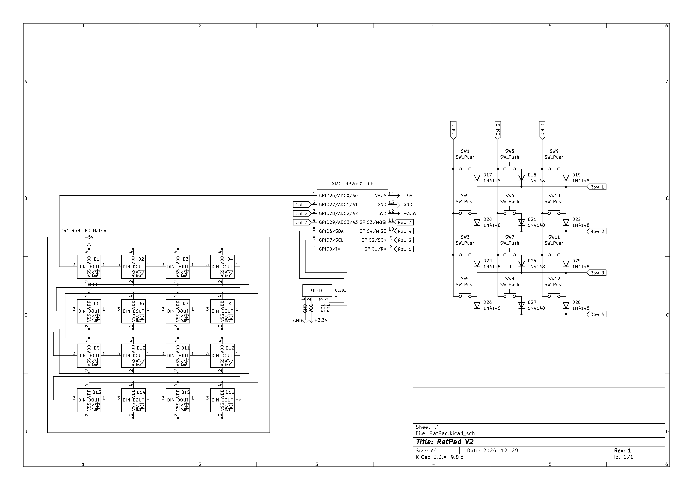
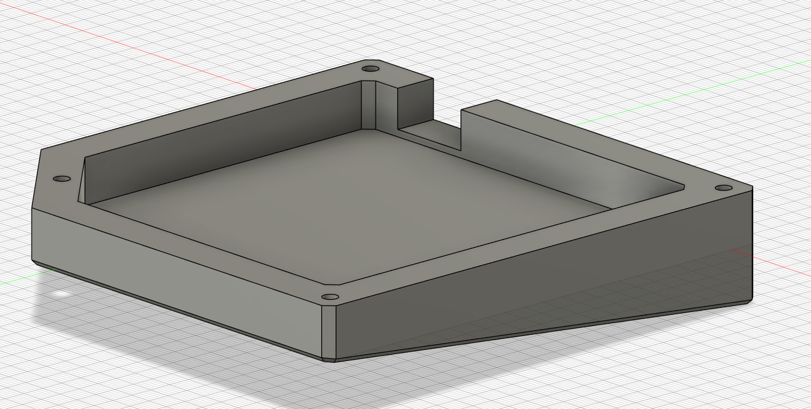
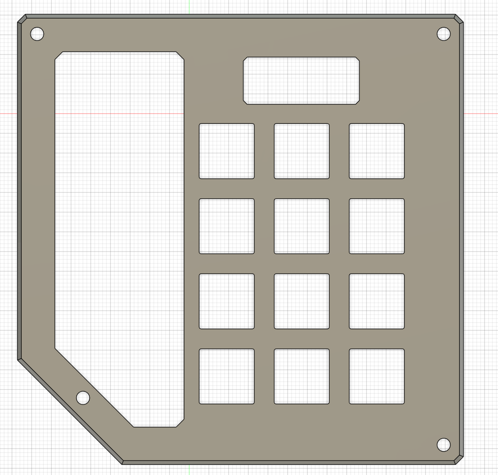

# RatPad

My own personal (rat-themed) hackpad! Featuring a decorative 4x4 RGB LED matrix, an informational screen, many rats, and a ton of keys to control anything with!

The goal of this project is to learn! I have been wanting experience with PCBs, Fusion, and soldering for a while and this is a good
all-in-one project to get that experience at no cost to me.

Part of Hack Club's Blueprint YSWS.

## Features

- 12 Keys.
- 4x4 RGB LED Matrix.
- 0.91in OLED display.
- Control various things from the keypad using the buttons on it, using the display to see what's happening.
- LED Matrix for cool decoration. No practical purpose. (I know this will be terrible to program, but here we are.)
- A rat drawn on the silkscreen of the PCB. (This is a REQUIREMENT. I will have no less.)

## Todo

- [x] Schematic
- [x] Routing PCB
- [x] Case Design
- [ ] Basic Firmware
- [ ] Get Physical Items
- [ ] Program It

## Images

*Note: Everything you see here is currently subject to change. This is the prototype version, nothing physical exists thus far.*
