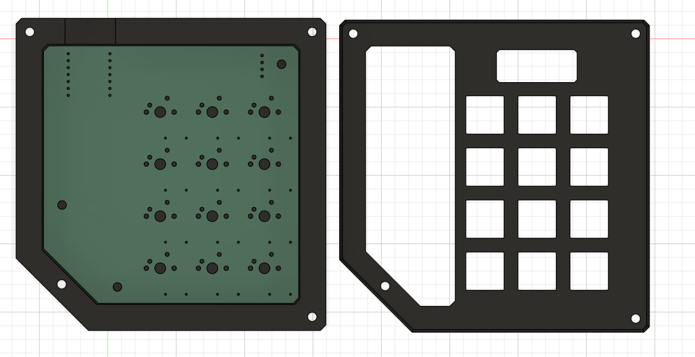
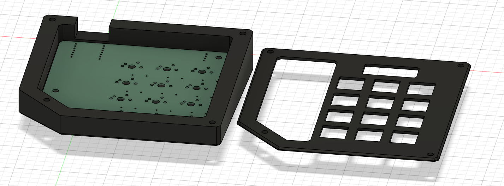
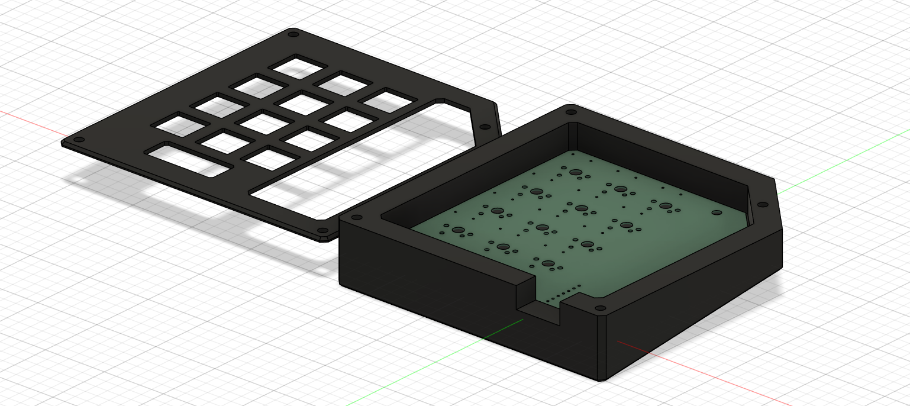

# RatPad

My own personal (rat-themed) hackpad! Featuring a decorative 4x4 RGB LED matrix, an informational screen, rats, and a ton of keys to control anything with!

The goal of this project is to learn! I have been wanting experience with PCBs, Fusion, and soldering for a while and this is a good
all-in-one project to get that experience at no cost to me.

Part of Hack Club's Blueprint YSWS.

## Features

- 12 Keys.
- 4x4 RGB LED Matrix.
- 0.91in OLED display.
- Multiple layers, programmable keys, etc.
- LED Matrix for cool decoration. No practical purpose.
- A rat drawn on the silkscreen of the PCB.
- Black + Blue theme
- KMK Firmware

## Todo

- [x] Schematic
- [x] Routing PCB
- [x] Case Design
- [x] Basic Firmware
- [ ] Get Physical Items
- [ ] Solder PCB
- [ ] Finished Build!

## PCB

Here's the schematic and routed PCB! There's a lot of stuff on the silkscreen for fun and the LEDs and keys are both routed in matrices to save on GPIOs! In fact, I have one GPIO available still!

I decided to do chamfered edges on all the corners, with a big one in the lower left since I had extra space and figured it would look nice.

I've also included M3 screw holes, I don't think I'll be using them though.

I definitely should have added a ground plane, but it should be fine.

## Case

Here's all the images of the case! There's a window on the left of the lid to see all the interesting electronics, silkscreen, and LED matrix, a hole for the OLED, and all the holes for the keys.

The chamfered edges from the PCB are reflected on the case as well.

The lid is held on with 4 M3 screws.

I would love to add some acrylic to the window and/or oled, but I don't have access to a laser cutter or any acrylic in the first place.

## BOM

| Item | Quantity |
| ---- | -------- |
| PCB | 1 |
| Through-Hole Seeed XIAO RP2040 | 1 |
| MX Style Switches | 12 |
| DSA Keycaps | 12 |
| Through-Hole IN4148 Diodes | 12 |
| 0.91in OLED I2C Display | 1 |
| SK6812 MINI-E LEDs | 16 |
| M3x16mm Screws | 4 |
| 3d Printed Parts (case + lid) | 2 |